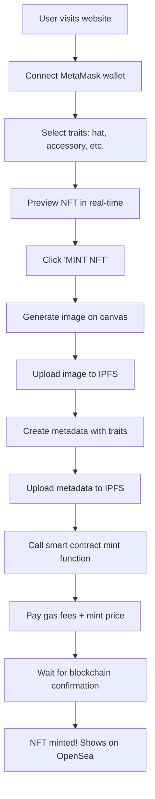

# Complete MOJO NFT Generator Workflow

## 🎯 **Overview: How Everything Works Together**

Your MOJO NFT generator uses **dynamic generation** - assets stay on your server, NFTs are created and uploaded only when users mint them. This is much more efficient than pre-generating thousands of combinations.

## 📋 **Complete Setup Process**

### **Phase 1: Asset Preparation** 
```
1. Create MOJO artwork (base character + traits)
2. Export as 1600x1600 PNG files with transparency
3. Organize in assets/ folder structure
4. Test combinations in the generator
```

### **Phase 2: Smart Contract Deployment**
```
1. Choose contract template (Basic/Optimized/Abstract)
2. Deploy to testnet first
3. Test minting functionality
4. Deploy to mainnet
5. Update contract address in frontend
```

### **Phase 3: IPFS Integration**
```
1. Set up Pinata account
2. Get API keys/JWT token
3. Update upload functions in code
4. Test image and metadata uploads
```

### **Phase 4: Testing & Launch**
```
1. Test complete user flow
2. Verify NFTs appear on OpenSea
3. Test on mobile devices
4. Launch to users!
```

---

## 🔄 **User Experience Flow**



---

## 🛠 **Technical Architecture**

### **Frontend (Your Web App)**
- **Canvas rendering**: Combines trait images in real-time
- **Web3 integration**: Connects to MetaMask wallet
- **IPFS uploads**: Sends images/metadata to storage
- **Smart contract calls**: Mints NFTs on blockchain

### **IPFS Storage**
- **Images**: Each generated NFT image
- **Metadata**: JSON with traits and image link
- **Permanent**: Files stay accessible forever

### **Smart Contract**
- **Minting logic**: Creates new NFT tokens
- **Metadata links**: Points to IPFS for NFT data
- **Ownership**: Tracks who owns each NFT

---

## 📁 **File Organization**

```
MOJO-NFT-Generator/
├── 🌐 Frontend Files
│   ├── index.html          # Main web page
│   ├── script.js           # Generator logic + Web3
│   ├── styles.css          # Styling
│   └── assets/             # Your MOJO artwork
│       ├── base/MOJO.png   # Base character
│       ├── hat/            # Headwear traits
│       └── item/           # Accessory traits
│
├── 📜 Smart Contracts
│   ├── MojoNFT.sol         # Basic ERC721
│   ├── MojoNFT_Optimized.sol # ERC721A (recommended)
│   ├── MojoNFT_Abstract.sol  # For Abstract blockchain
│   ├── hardhat.config.js   # Deployment config
│   └── scripts/deploy.js   # Deployment script
│
└── 📚 Documentation
    ├── README.md           # Main setup guide
    ├── DEPLOYMENT_GUIDE.md # Contract deployment
    ├── ASSET_SETUP_GUIDE.md # Asset preparation
    └── IPFS_INTEGRATION.md  # Storage setup
```

---

## ⚡ **Step-by-Step Implementation**

### **Step 1: Prepare Your MOJO Assets**

1. **Create your base MOJO character** (1600x1600 PNG)
2. **Design trait variations**:
   - Hats: crown, cap, helmet, etc.
   - Accessories: sword, wand, coin, etc.
   - Each as transparent PNG overlay

3. **Replace placeholder assets**:
   ```bash
   # Replace these files with your artwork
   assets/base/MOJO.png
   assets/hat/crown.png
   assets/hat/cap.png
   assets/item/sword.png
   assets/item/wand.png
   # etc...
   ```

4. **Test in the generator** - make sure traits align properly

### **Step 2: Set Up IPFS Storage**

1. **Create Pinata account** at [pinata.cloud](https://pinata.cloud)
2. **Generate JWT token** in API Keys section
3. **Update script.js** with your credentials:
   ```javascript
   const PINATA_JWT = "your_jwt_token_here";
   ```

### **Step 3: Deploy Smart Contract**

**Option A: Quick Deploy (Remix IDE)**
1. Go to [remix.ethereum.org](https://remix.ethereum.org)
2. Copy `MojoNFT_Optimized.sol` into a new file
3. Compile with Solidity 0.8.19
4. Deploy with MetaMask to your chosen network
5. Copy contract address

**Option B: Professional Deploy (Hardhat)**
1. ```bash
   cd contracts
   npm install
   cp env-example.txt .env
   # Edit .env with your private key
   ```
2. ```bash
   npx hardhat run scripts/deploy.js --network goerli
   ```

### **Step 4: Connect Everything**

1. **Update contract address** in `script.js`:
   ```javascript
   const NFT_CONTRACT_ADDRESS = "0xYourDeployedContractAddress";
   ```

2. **Test the complete flow**:
   - Connect wallet
   - Select traits
   - Try minting an NFT
   - Check it appears on OpenSea

---

## 🎯 **What Happens When Someone Mints**

Let's trace through a real example:

### **User Action**: Sarah wants to mint a MOJO with crown + sword

1. **Sarah connects MetaMask** ✅
2. **Selects traits**: Crown headwear, Magic sword accessory
3. **Previews NFT**: Canvas shows MOJO base + crown + sword
4. **Clicks "MINT NFT"** 💎

### **Behind the Scenes**:
```javascript
// 1. Generate image from canvas
const canvas = document.getElementById('pfpCanvas');
const imageBlob = canvas.toBlob();

// 2. Upload to IPFS
const imageHash = await uploadToIPFS(imageBlob);
// Returns: "QmXyZ123..." 

// 3. Create metadata
const metadata = {
    name: "MOJO PFP #1234",
    description: "A unique MOJO character NFT",
    image: "ipfs://QmXyZ123...",
    attributes: [
        { trait_type: "Base", value: "MOJO" },
        { trait_type: "Headwear", value: "Crown" },
        { trait_type: "Accessory", value: "Magic Sword" }
    ]
};

// 4. Upload metadata
const metadataHash = await uploadMetadataToIPFS(metadata);
// Returns: "QmAbc789..."

// 5. Mint NFT
const tx = await contract.mint(
    "0xSarah'sAddress", 
    "ipfs://QmAbc789..."
);

// 6. Wait for confirmation
await tx.wait();
// ✅ NFT minted! Token ID #1234 now belongs to Sarah
```

### **Result**:
- Sarah owns NFT #1234
- Image stored permanently on IPFS
- Metadata describes the traits
- NFT appears on OpenSea automatically
- Sarah can trade/sell it anytime

---

## 💡 **Key Advantages of This Approach**

### **✅ For Users**:
- Create truly unique NFTs on-demand
- No duplicate combinations
- Instant preview before minting
- Works on mobile devices
- Lower gas costs (ERC721A)

### **✅ For You (Creator)**:
- No need to pre-generate thousands of images
- Much lower storage costs
- Easy to add new traits
- Real-time analytics
- Professional Web3 integration

### **✅ For the Ecosystem**:
- Decentralized storage (IPFS)
- Standard NFT format (ERC721)
- OpenSea compatible
- Blockchain verified ownership

---

## 🚀 **Ready to Launch?**

Your MOJO NFT generator is now a complete Web3 application that:
1. ✅ Generates unique PFPs in real-time
2. ✅ Stores data permanently on IPFS  
3. ✅ Mints NFTs on the blockchain
4. ✅ Works with MetaMask wallets
5. ✅ Appears automatically on OpenSea
6. ✅ Handles mobile users
7. ✅ Includes error handling and notifications

**Next steps**: Replace the placeholder assets with your actual MOJO artwork, deploy your smart contract, and start minting! 🎨⚡
